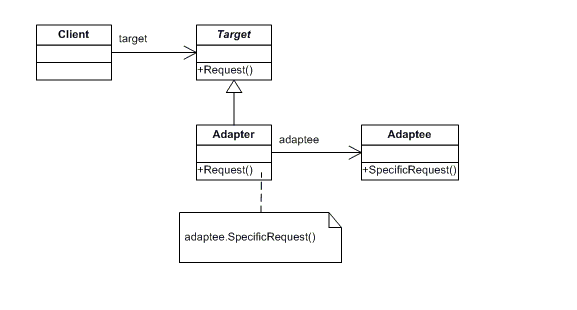

# **Adapter**

O Adapter é um padrão de projeto estrutural que permite objetos com interfaces incompatíveis colaborarem entre si.
 
OAdapter converte uma determinada interface ou classe para outra interface que o código espera, permitindo que módulos com interfaces, antes incompatíveis, agora possam se comunicar.

Abaixo temos um exemplo da estrutura UML do pattern:

