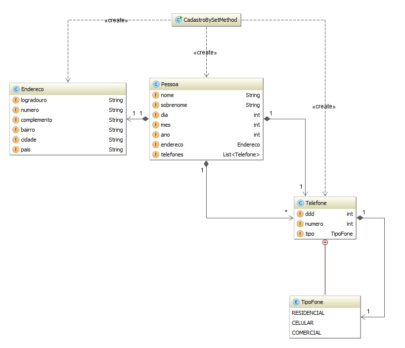
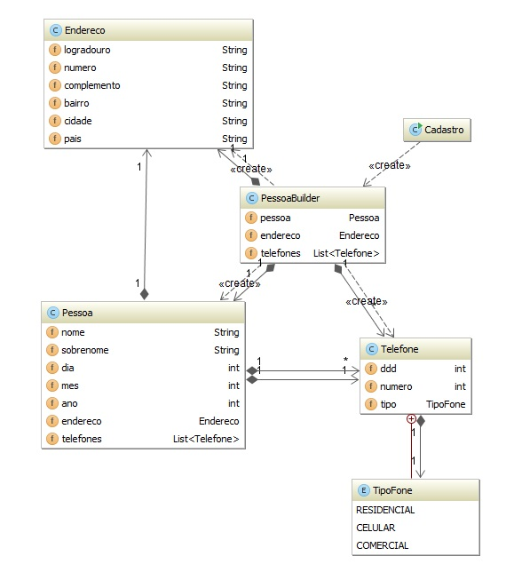

# **Builder**

Builder é um padrão de design criacional, que permite construir objetos complexos passo a passo.

Ao contrário de outros padrões criacionais, o Builder não requer produtos para ter uma interface comum. Isso possibilita a produção de produtos diferentes usando o mesmo processo de construção.

Para que se veja de forma mais clara a vantagem do Builder Pattern, vamos ver um exemplo que envolve a seguintes classes: Pessoa, Endereco e Telefone, conforme Figura 1:

O método construtor da classe PessoaBuilder cria uma instancia para os objetos Pessoa, Endereco e também para a lista de telefones ( java.util.List ). O método estático builder() retorna uma instancia para a classe PessoaBuilder. Os métodos como nome iniciados por add(), como addNome(), recebem como argumento o valor a ser inserido no objeto e estes métodos retornam a instancia atual de PessoaBuilder, criadas ou pelo método builder() ou por new PessoaBuilder(). Já o método get() tem como objetivo retornar uma instancia da classe Pessoa com os valores que foram inseridos ao objeto pessoa por meio dos métodos add(). Na Figura 2 é possível ver o diagrama de classe que representa esta nova implementação:

