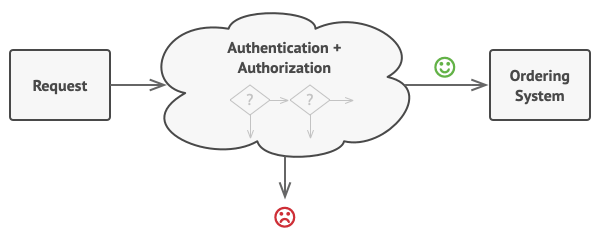
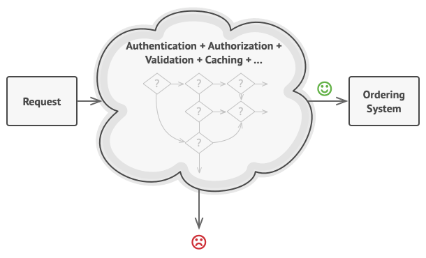

# **Chain of Responsibility**

Chain of Responsibility é um padrão de design comportamental que permite que você passe solicitações ao longo de uma cadeia de manipuladores. Ao receber uma solicitação, cada manipulador decide processar a solicitação ou passá-la para o próximo manipulador da cadeia.  

## Problema: 

Imagine que você está trabalhando em um sistema de pedidos on-line. Você deseja restringir o acesso ao sistema para que apenas usuários autenticados possam criar pedidos. Além disso, os usuários que possuem permissões administrativas devem ter acesso total a todos os pedidos.

Depois de um pouco de planejamento, você percebeu que essas verificações devem ser realizadas sequencialmente. O aplicativo pode tentar autenticar um usuário para o sistema sempre que receber uma solicitação que contenha as credenciais do usuário. No entanto, se essas credenciais não estão corretas e a autenticação falhar, não há razão para prosseguir com quaisquer outras verificações.

- A solicitação deve passar por uma série de verificações antes que o próprio sistema de pedidos possa lidar com isso.

- Quanto maior o código cresceu, mais bagunçado ele se tornou.  

## Solução:

Como muitos outros padrões de design comportamental, a Cadeia de Responsabilidade se baseia em transformar comportamentos particulares em objetos autônomos chamados manipuladores. No nosso caso, cada verificação deve ser extraída para sua própria classe com um único método que realize a verificação. A solicitação, juntamente com seus dados, é passada para este método como argumento.

O padrão sugere que você vincule esses manipuladores a uma corrente. Cada manipulador ligado tem um campo para armazenar uma referência ao próximo manipulador na cadeia. Além de processar uma solicitação, os manipuladores passam a solicitação mais adiante ao longo da cadeia. A solicitação viaja ao longo da cadeia até que todos os manipuladores tenham tido a chance de processá-la.

Aqui está a melhor parte: um manipulador pode decidir não passar a solicitação mais adiante na cadeia e efetivamente parar qualquer processamento adicional.

Em nosso exemplo com sistemas de pedidos, um manipulador realiza o processamento e, em seguida, decide se deve passar a solicitação mais adiante na cadeia. Supondo que a solicitação contenha os dados certos, todos os manipuladores podem executar seu comportamento primário, seja verificação de autenticação ou cache.

- Os manipuladores estão alinhados um a um, formando uma corrente.